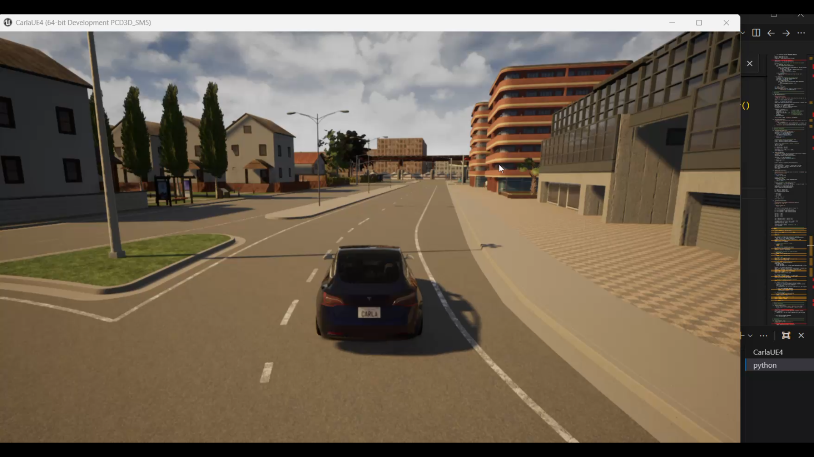
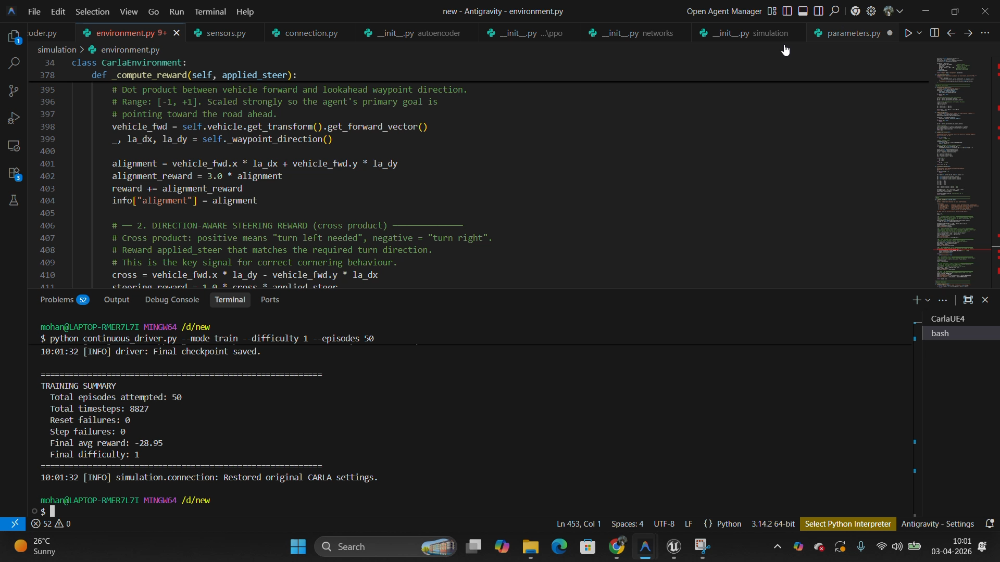

# 🚗 NeuroDrive-RL

### Autonomous Driving using Reinforcement Learning and CARLA Simulator

NeuroDrive-RL is a Reinforcement Learning–based autonomous driving system developed using the CARLA Simulator and Proximal Policy Optimization (PPO).

The project focuses on:

- Autonomous lane following
- Vehicle navigation
- Real-time driving control
- PPO-based policy learning
- Camera-based perception
- Autonomous vehicle simulation

---

# 📌 Project Overview

This project demonstrates the integration of:

- Reinforcement Learning
- Autonomous Driving
- Computer Vision
- Vehicle Control Systems
- Deep Learning
- CARLA-based Simulation

inside a realistic simulated urban environment.

The autonomous agent learns steering and throttle control using PPO (Proximal Policy Optimization) while interacting with the CARLA simulator in real time.

---

# ✨ Features

✅ PPO-based Reinforcement Learning agent  
✅ CARLA Simulator integration  
✅ Autonomous lane following  
✅ Dynamic route generation  
✅ Camera-based observation system  
✅ Real-time vehicle control  
✅ Vehicle steering smoothing  
✅ Training and testing modes  
✅ Reward-based policy optimization  
✅ Spectator camera visualization  
✅ Autonomous navigation in urban roads  

---

# 🛠 Tech Stack

| Technology | Purpose |
|---|---|
| Python 3.7 | Core programming language |
| CARLA 0.9.8 | Autonomous driving simulator |
| PyTorch | Reinforcement learning framework |
| PPO | Policy optimization algorithm |
| NumPy | Numerical computation |
| OpenCV | Image processing |
| Unreal Engine | Rendering and physics engine |
| Git & GitHub | Version control |

---

# ⚙️ CARLA Version Compatibility

This project was developed and tested using:

| Component | Version |
|---|---|
| CARLA Simulator | 0.9.8 |
| Python | 3.7 |
| Operating System | Windows 10/11 (64-bit) |

⚠️ Using different versions of CARLA or Python may cause compatibility issues with the CARLA Python API.

---

# 📥 Download CARLA Simulator

Download CARLA 0.9.8 from the official release page:

https://github.com/carla-simulator/carla/releases/tag/0.9.8

---

## After Downloading

1. Extract the downloaded package
2. Open:

```bash
WindowsNoEditor/
```

3. Run:

```bash
CarlaUE4.exe
```

---

# 🧠 System Architecture

```text
CARLA Environment
        ↓
Camera Sensor Input
        ↓
Observation Processing
        ↓
PPO Reinforcement Learning Agent
        ↓
Steering & Throttle Prediction
        ↓
Vehicle Control Execution
        ↓
Reward Calculation
        ↓
Policy Optimization
```

---

# 📂 Project Structure

```bash
NeuroDrive-RL/
│
├── autoencoder/
│   └── encoder.py
│
├── checkpoints/
│   ├── latest.pth
│   └── latest_encoder.pth
│
├── networks/
│   └── ppo/
│       ├── agent.py
│       └── ppo.py
│
├── simulation/
│   ├── connection.py
│   ├── environment.py
│   └── sensors.py
│
├── assets/
│   ├── carla_demo.png
│   └── training_progress.png
│
├── continuous_driver.py
├── parameters.py
└── README.md
```

---

# 🚀 Installation & Setup Guide

---

## Step 1 — Clone Repository

```bash
git clone https://github.com/crystalknife/NeuroDrive-RL.git
cd NeuroDrive-RL
```

---

## Step 2 — Install Dependencies

Install required Python libraries:

```bash
pip install torch numpy opencv-python pygame
```

---

## Step 3 — Configure CARLA Python API

Open terminal inside the project folder and add CARLA API paths:

```bash
export PYTHONPATH=$PYTHONPATH:D:/car/WindowsNoEditor/PythonAPI/carla/dist/carla-0.9.8-py3.7-win-amd64.egg
```

Optional additional path:

```bash
export PYTHONPATH=$PYTHONPATH:D:/car/WindowsNoEditor/PythonAPI/carla
```

---

# 🎮 Starting CARLA Simulator

## Option 1 — Recommended for Low/Medium GPU Systems

Run CARLA without rendering for faster and more stable training:

```bash
CarlaUE4.exe -RenderOffScreen -quality-level=Low
```

✅ Recommended for:
- Faster training
- Lower GPU usage
- Stable RL learning

---

## Option 2 — Recommended for Good GPU Systems

Run CARLA with rendering enabled:

```bash
CarlaUE4.exe -quality-level=Low
```

✅ Recommended for:
- Real-time visualization
- Demonstrations
- Watching autonomous driving behavior

---

## Option 3 — Lightweight Windowed Mode

```bash
CarlaUE4.exe -quality-level=Low -windowed -ResX=800 -ResY=600
```

---

# 🏋️ Training the Model

## Start Training

```bash
python continuous_driver.py \
--mode train \
--checkpoint checkpoints/latest.pth \
--episodes 100 \
--difficulty 1
```

---

# 🎯 Difficulty Levels

| Difficulty | Description |
|---|---|
| 1 | Straight roads only |
| 2 | Mild curves |
| 3 | Moderate curves |
| 4 | Complex navigation |
| 5 | Hard navigation routes |

---

# 📌 Training Recommendations

✅ Start with difficulty 1  
✅ Train for 100–300 episodes initially  
✅ Use RenderOffScreen mode for weak GPUs  
✅ Use rendering mode for demonstrations  
✅ GPU acceleration improves performance significantly  

---

# 🧪 Testing the Trained Model

## Run Testing

```bash
python continuous_driver.py \
--mode test \
--checkpoint checkpoints/latest.pth \
--episodes 10 \
--difficulty 1
```

---

# 📈 Results

The trained reinforcement learning agent successfully demonstrated:

- Autonomous lane following
- Straight-road navigation
- Basic curve handling
- Reward optimization through PPO training
- Stable vehicle control
- Dynamic route following
- Real-time steering prediction

---

# 📸 Screenshots

## 🚘 Autonomous Driving Demo



---

## 📊 Training Progress



---

# ✅ Advantages

- Safe autonomous driving experimentation
- Realistic driving simulation
- Supports Reinforcement Learning research
- Real-time vehicle control
- Modular architecture
- Scalable for future autonomous driving systems

---

# ⚠️ Limitations

- Requires moderate-to-high hardware resources
- Performance depends on GPU capability
- Limited traffic interaction
- Simulation differs from real-world driving
- Requires training time for stable behavior

---

# 🔮 Future Improvements

- Traffic signal handling
- Multi-vehicle navigation
- Pedestrian detection
- Obstacle avoidance
- Semantic segmentation
- Real-world sensor integration
- Multi-camera support
- Advanced Deep RL optimization

---

# 👨‍💻 Author

Developed as a Reinforcement Learning and Autonomous Driving research project using CARLA Simulator and PPO.

---
